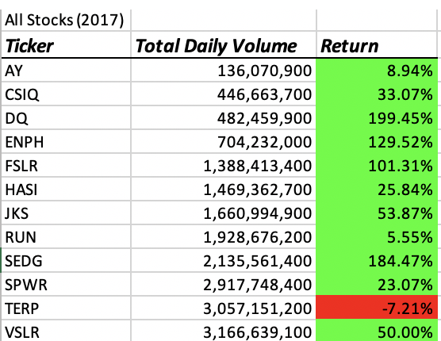
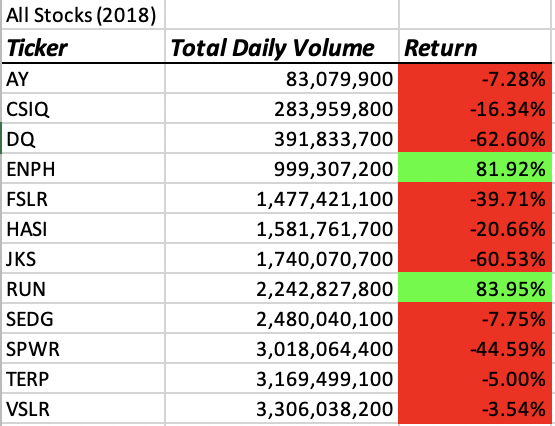
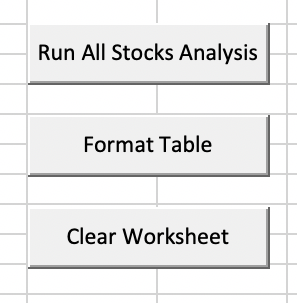

# Election_Analysis
***Overview***   
Client Steve has enlisted our support in order to automate his analysis of stock market perfomance over a 2 year window to help inform his clients of wise choices for their stock options. The goal of this project was to develop efficient VBA code to automate the analysis for Steve so that he might be able to use the macros on any set of stock market data and arrive at his desired statistics quickly and accurately. Specifically, he wishes to compare the total daily volume and yearly return for 14 different stocks in such a way that he can analyze additional or fewer stocks in the future with the same macros.    
***Result***   
The client asked that we specifically analyze the *Total Daily Volume* and the *Yearly Return* for each of the stocks listed below from 2017 to 2018.  
    
  
The project provided the following macros for client Steve.  
  
* **Run All Stocks Analysis** enables Steve to run these specific analysis on any worksheet that is similarly formatted with any number of observed tickers by prompting him for the year he wants to analyze.  
* **Format Table** enables Steve to tidy the output of **Run All Stocks Analysis** macro to ensure uniformly formatted tables for clarity and immediately identifying losses/gains.  
* **Clear Worksheet** appropriately erases the worksheet to all for repeatedly running the **Run All Stocks Analysis** macro without concern for formating issues or errors.   
**Analysis**  
Overall, 2017 was a very good year for alternative energy producing companies, save for *TerraForm Power (TERP)*. In fact, the client's parents inverstment interest, *Daqo New Energy Corp (DQ)*, yielded the highest returns of any of the observed stocks nearly tripling. However, 2018 makes for a very different picture for renewable energy showing big losses for each of the monitored companies save for *Enphase Energy Inc. (ENPH)* and *Sunrun Inc. (RUN)* who gained nearly 82% and 84%, respectively. While *DQ* stocks would have returned an increased value over the 2 year window, it is clear that diversifying his parents' stock portfolio would have resulted in significantly greater gains. For example, any investment in *ENPH* stock would have out performed *DQ* stocks nearly 3x over in the same 2-year window. This project strongly recommends diversifying the portfolio of renewable energy stocks.    
***Summary***  
Refactoring code is essential to the data scientist/analyist's workflow. It should be a reflective process throughout the code-writing process and post writing. Code is always changing and updating and therefore the way to code more efficiently or stronger will change over time. Making a habit of reviewing code, if not refactoring outright, periodically will serve an upcoming data scientist/analysis well. Such a practice will not only make for better programs, but will increase the retention and fluency of the coder themself.  
**Comparing Run Times**  
Speed is a clear indicator of code efficiency and the amount of memory taken to perfom the tasks within the program. Immediately below are the run times of my original code that I wrote during the module 2 exercises. Following, are the run times of the refactored code from the given VBA_Challenge script.  
